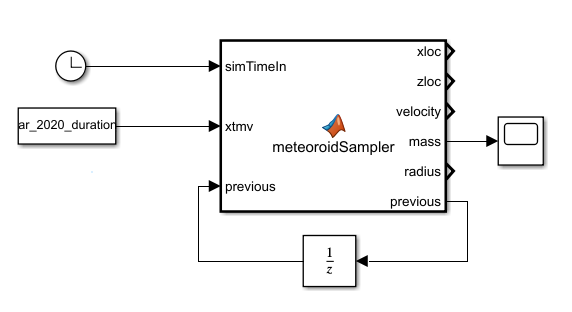
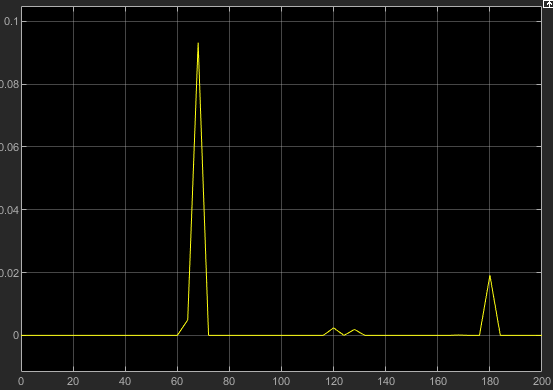

# Simulink

A block for integrating meteorite sampling in a Simulink model.



## Usage

Generating stochastic events takes a relatively long computational time, especially for large areas. This is not realistic to be done in a real-time simulation. Thus, this block uses pre-generated XTMV files, and reads from them at the apropriate sim times.

### How to generate an xtmv .mat file

use the `generateImpactData()` function provided in the directory above this.

```generateImpactData(xLength, yLength, latitude, longitude, duration, startDate)```

Note that x is east/west length, and y is north/south length.

Simply running this in a matlab console will create both a .csv and a .mat file with the same data. Make sure to select the correct .mat file in the simulink block for the sim you plan to run. 

### Using in a sim

This block takes no inputs other than the reference file and a Sim clock.

The sim block only reports the data for an impact at the time it occurs, and reports zero otherwise. This is true for all values output by the block. Velocity/location vectors are aligned with other models, where X is North, Z is East, and Y is normal to the surface. 



*Example mass output over time*